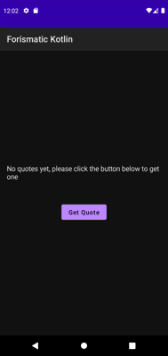

# Forismatic Kotlin Android Client

Simple Android client with an MVVM architecture that shows random quotes using the [Forismatic API](https://www.forismatic.com/en/).

[Git commit](https://github.com/plusmobileapps/forismatic-api-kotlin/commit/a802d06f31fcf2f28f8d3927ed3062de77e19425) which adds and implements everything. 

## Libraries Used

* [Ktor](https://ktor.io/) - networking
* [Kotlinx.serialization](https://github.com/Kotlin/kotlinx.serialization) - json serialization
* [Hilt](https://developer.android.com/training/dependency-injection/hilt-android) - dependency injection
